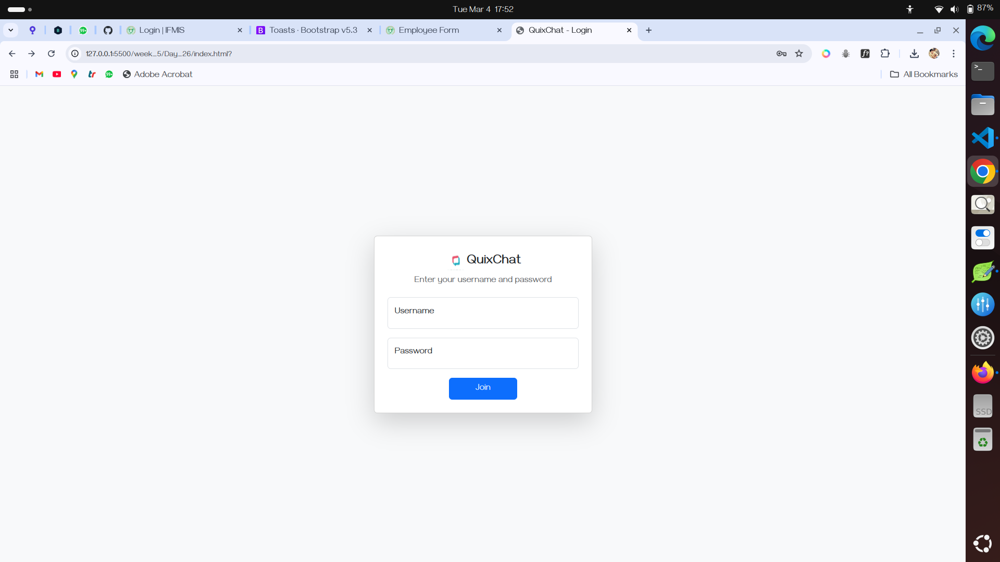
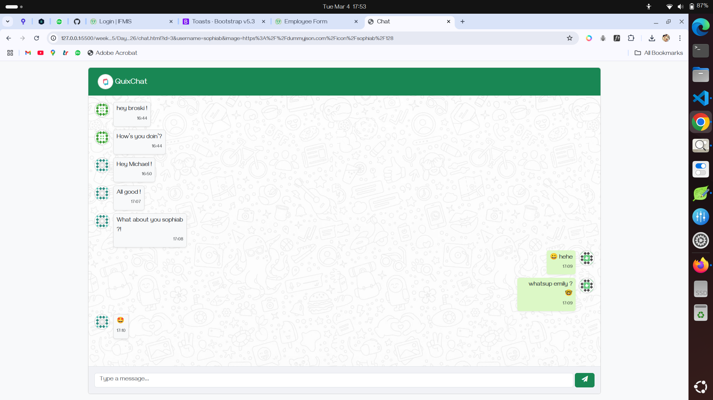

# QuixChat

QuixChat is a simple chat application that allows users to log in and communicate with each other.

## Screenshots

### 1. Login Page

This is the initial login screen where users enter their credentials.

### 2. Loading State

After entering credentials, the application shows a loading state while verifying the login details.

### 3. Login Failed

If the credentials are incorrect, an error message is displayed.

### 4. Chat Interface

After successful login, the user is redirected to the chat interface where they can send and receive messages.

## Features

- User authentication
- Real-time messaging

## Technologies Used

- HTML, CSS, JavaScript, Bootstrap, JQuery
