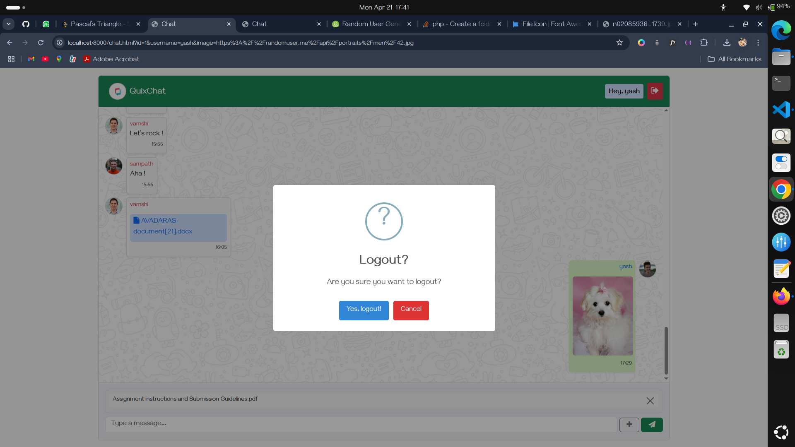

# QuixChat

QuixChat is a simple chat application that allows users to log in and communicate with each other.

## Screenshots

### 1. Login Page

  
This is the initial login screen where users enter their credentials.

### 2. Chat Interface

  
After successful login, the user is redirected to the chat interface where they can send and receive messages or exchange Media.

### 3. Logout Dialogue

  
A confirmation dialog appears when the user chooses to log out.

### 4. File Upload Container

  
File upload area in the chat interface.

### 5. Profile Picture Modal

  
Allows users to view media shared in a Bootstrap Modal.

### 6. Register Page

  
Registration screen for new users.

## Features

- User authentication
- Real-time messaging
- File sharing and image previews
- Profile image upload

## Installation

1. Clone the repository:
   ```sh
   git clone git@github.com:Yashwanth-chary/Code-School-4.0.git
   ```
2. Navigate to the project directory:
   ```sh
   cd quixchat
   ```
3. Make sure PHP and a web server (like Apache or Nginx) are installed and configured.
4. Create a `.env` file and configure your database and other environment variables.
5. Import the postgreSQL database structure.
6. Start the PHP server:
   ```sh
   php -S localhost:8000
   ```
7. Open the application in your browser:
   ```
   http://localhost:8000
   ```

## Technologies Used

- HTML, CSS, JavaScript (Frontend)
- PHP (Backend)
- postgreSQL (Database)


